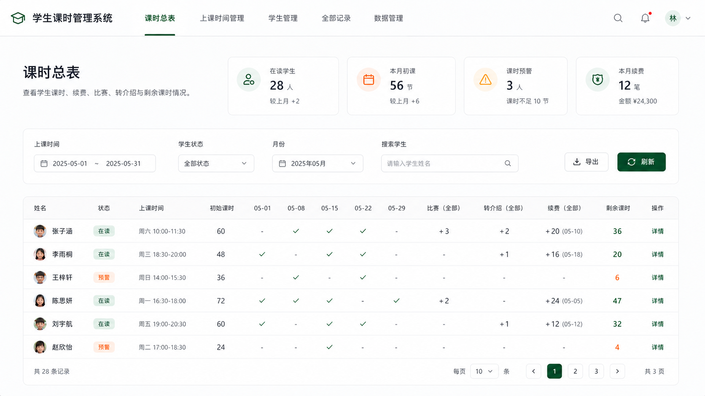

# ClassLedger 学生课时管理系统

ClassLedger 是一个供老师个人使用的本地学生课时管理系统，用于替代传统 Excel 课时表。

系统采用单文件结构，只需双击 `index.html` 即可在 Chrome、Edge 等现代浏览器中使用。所有正式功能均使用 HTML、CSS 和原生 JavaScript 实现，不需要服务器、数据库、Node.js、外部框架、CDN 或网络连接。



## 当前状态

当前已完成：**阶段四：课时总表**。

已实现功能：

- 顶部横向导航、五个页面切换、URL Hash 路由和刷新恢复
- 上课时间与学生的新增、编辑、删除和搜索
- 正常上课、续费、转介绍、比赛和退费五类记录的新增、编辑和删除
- 同一学生同一天重复正常上课记录的二次确认
- 购买与赠送课时、退回购买与取消赠送课时分字段保存
- 根据初始课时和全部历史记录实时计算剩余课时
- 四个实时统计卡片以及上课时间、状态、月份、姓名组合筛选
- 按月份动态生成正常上课日期列，同日多条记录自动合计显示
- 比赛、转介绍和续费全部历史累计摘要及历史明细弹窗
- 按上课时间筛选并勾选在读学生进行批量扣课
- 所有正式数据立即保存到 `localStorage`，并兼容旧结构和未知字段
- 统一弹窗、字段校验、成功提示、键盘操作和响应式表格

当前尚未实现全部记录高级筛选、学生详情、数据导入导出和清空数据。

下一阶段范围以新的阶段任务为准。

详细进度请查看 [PROGRESS.md](./PROGRESS.md)。

## 快速开始

1. 保持项目文件位于同一文件夹中。
2. 双击 `index.html`。
3. 选择 Chrome 或 Edge 打开。
4. 先在“上课时间管理”中建立固定时段。
5. 在“学生管理”中添加学生并设置初始课时。
6. 进入“全部记录”，选择记录类型后新增课时变化记录。
7. 返回“课时总表”查看月度明细，或筛选上课时间后批量扣课。

不需要执行安装命令，也不需要启动本地服务器。

> 数据保存在当前浏览器的 `localStorage` 中。更换浏览器、浏览器配置或文件位置时，可能使用不同的本地存储空间。正式数据导入导出功能将在后续阶段实现。

## 阶段三使用说明

### 全部记录

“全部记录”页面包含五个标签：

- 正常上课：扣除学生课时
- 续费：分别增加购买课时和赠送课时
- 转介绍：增加赠送课时
- 比赛：扣除比赛课时
- 退费：分别扣除退回购买课时和取消赠送课时

选择标签后点击右侧新增按钮即可创建对应记录。每行提供编辑和删除操作，删除前必须再次确认。

正常上课记录如果与已有记录的学生和日期相同，第一次保存只会显示提示；再次点击“仍然保存”才会真正写入，两条记录不会自动合并。

### 剩余课时

学生管理列表中的“剩余课时”为只读计算结果：

```text
剩余课时
= 初始课时
+ 续费购买课时
+ 续费赠送课时
+ 转介绍赠送课时
- 正常上课扣课
- 比赛扣课
- 退回购买课时
- 取消赠送课时
```

剩余课时不会保存为可编辑字段。新增、编辑或删除记录后，系统会依据全部历史记录重新计算。

## 阶段四使用说明

### 月度课时总表

课时总表默认显示在读学生和当前月份。上课时间、学生状态和姓名搜索只筛选学生行；月份选择只切换正常上课日期列。

同一学生在同一天存在多条正常上课记录时，日期单元格显示扣课合计。比赛、转介绍、续费摘要和剩余课时始终读取全部历史数据，不随月份变化。点击对应历史摘要可以查看完整记录。

顶部“本月扣课”和“本月续费”按浏览器当前自然月统计，因此切换表格月份不会改变统计卡片。

### 批量扣课

1. 使用“上课时间”筛选目标班级或时段。
2. 勾选需要扣课的在读学生，也可以使用表头复选框全选当前可见学生。
3. 点击“批量扣课”，填写日期、每人扣除课时和备注。
4. 确认后系统会为每名学生分别生成一条正常上课记录。

冻课和流失学生不能参与批量扣课。如果某些学生在所选日期已有正常上课记录，系统会先提示重复学生，只有再次确认才会继续保存。

## 页面结构

| 页面 | 当前状态 | 用途 |
| --- | --- | --- |
| 课时总表 | 阶段四已完成 | 查看统计、筛选月度明细、历史累计、剩余课时并批量扣课 |
| 上课时间管理 | 阶段二已完成 | 管理星期、开始时间、结束时间、备注和关联学生人数 |
| 学生管理 | 阶段三已扩展 | 管理学生资料并查看自动计算的剩余课时 |
| 全部记录 | 阶段三已完成 | 管理正常上课、续费、转介绍、比赛和退费记录 |
| 数据管理 | 存储底座完成 | 后续导出、导入和清空本地数据 |

## 本地数据

存储键名：

```text
studentHoursManagerData
```

基础结构：

```javascript
{
  version: "4.0",
  classTimes: [],
  students: [],
  lessonRecords: [],
  renewalRecords: [],
  referralRecords: [],
  competitionRecords: [],
  refundRecords: []
}
```

五类记录字段：

```javascript
// 正常上课
{ id, studentId, date, hours, note }

// 续费：购买和赠送分开
{ id, studentId, date, purchasedHours, giftHours, note }

// 转介绍
{ id, studentId, date, giftHours, note }

// 比赛
{ id, studentId, date, hours, note }

// 退费：购买和赠送分开
{ id, studentId, date, refundedPurchasedHours, cancelledGiftHours, note }
```

数据原则：

- 页面启动时不得自动清空或覆盖已有数据。
- 旧数据结构必须兼容读取并保留已有记录和未知字段。
- 所有新增、编辑和删除只有在成功写入后才更新界面。
- 购买课时和赠送课时必须分开保存。
- 剩余课时只能根据全部历史记录计算，不能直接修改或存储。
- 月份筛选只影响正常上课日期列。
- 比赛、转介绍和续费始终显示全部历史记录。

## 技术与界面约束

- 所有正式功能代码放在 `index.html` 中。
- 只使用 HTML、CSS 和原生 JavaScript。
- 不使用后端、数据库、Node.js、外部框架、CDN 或联网资源。
- 不开发登录、账号、头像、老师姓名、通知和权限功能。
- 使用深绿色主色、白色背景、浅灰边框、轻圆角和大量留白。
- 删除、清空和覆盖导入操作必须二次确认。
- 所有数字输入必须校验。

完整需求请查看 [REQUIREMENTS.md](./REQUIREMENTS.md)。

## 项目文件

```text
ClassLedger/
├─ index.html          # 系统全部正式功能代码
├─ README.md           # 项目说明与阶段概览
├─ REQUIREMENTS.md     # 完整需求与验收标准
├─ PROGRESS.md         # 详细开发进度
├─ AGENTS.md           # 开发约束与工作流程
└─ ui-reference.png    # 界面设计参考图
```

## 阶段维护规则

每完成一个新阶段，必须同步更新：

1. 本 README 的“当前状态”“已验证功能”“下一阶段”和必要的使用说明。
2. `PROGRESS.md` 中的当前阶段、已完成功能、测试结果、待开发功能和已知问题。
3. 与数据结构、使用方式或项目文件有关的其他说明。

阶段提交说明统一使用：

```text
完成阶段X：阶段名称
```

例如：

```text
完成阶段一：系统基础框架
完成阶段二：上课时间和学生管理
完成阶段三：记录管理和剩余课时计算
完成阶段四：课时总表
```

## 阶段一测试记录

- 已通过 `file://` 方式在 Chrome 中直接打开。
- 五个页面切换、刷新、前进和后退正常。
- 弹窗打开、关闭和焦点恢复正常。
- 首次初始化、刷新读取和旧数据兼容正常。
- 损坏 JSON 不会被自动覆盖。
- 已检查 375px、768px、1024px、1440px 和 1675px 页面宽度。
- 浏览器控制台无错误或警告，未请求任何外部资源。

## 阶段二测试记录

- 上课时间和学生的新增、编辑、删除、搜索、取消及刷新恢复均通过。
- 时间先后关系、空白姓名、负数、非数字和小数课时校验均通过。
- 删除时段解除学生关联、删除学生清理五类记录且保留其他记录均通过。
- 旧版本、缺失集合、未知字段、损坏 JSON 和模拟写入失败保护均通过。
- 已检查 375px、768px、1024px、1440px 和 1675px 页面宽度。
- Chrome 控制台无错误或警告，仅加载本地 `index.html`。

## 阶段三测试记录

- JavaScript 语法、HTML ID、Git 空白和禁止项静态检查通过。
- 余额公式、浮点精度、日期校验、日期排序和五类数组映射测试通过。
- 五类新增、续费/退费分字段、续费编辑和未知字段保留测试通过。
- 正常上课重复提醒的首次阻止与再次确认保存测试通过。
- 删除成功、删除写入失败保护及余额重算测试通过。
- 阶段三完成时自动化浏览器未能访问 `file://`；阶段四已使用本机 Chrome 对这些核心流程完成补充回归。

## 阶段四测试记录

- 使用本机 Chrome 以 `file://` 直接打开，无需启动服务器或安装项目依赖。
- 四个统计卡片、四类筛选、动态日期列、同日扣课合计和月份隔离规则均通过。
- 比赛、转介绍、续费全部历史摘要、历史明细弹窗及剩余课时计算均通过。
- 批量全选、冻课/流失禁选、数字校验、重复提醒、再次确认和一人一条记录均通过。
- 批量保存后的即时重算、刷新恢复和未知顶层字段保留均通过。
- 模拟 `localStorage` 写入失败时未产生部分记录，弹窗、错误信息和学生选择均正确保留。
- 总表快捷扣课、添加记录和编辑学生的目标学生预选均通过。
- 375px、768px、1024px、1440px 和 1675px 均无页面级横向溢出，表格可在容器内滚动；桌面与移动端视觉检查正常，Chrome 控制台无错误。
